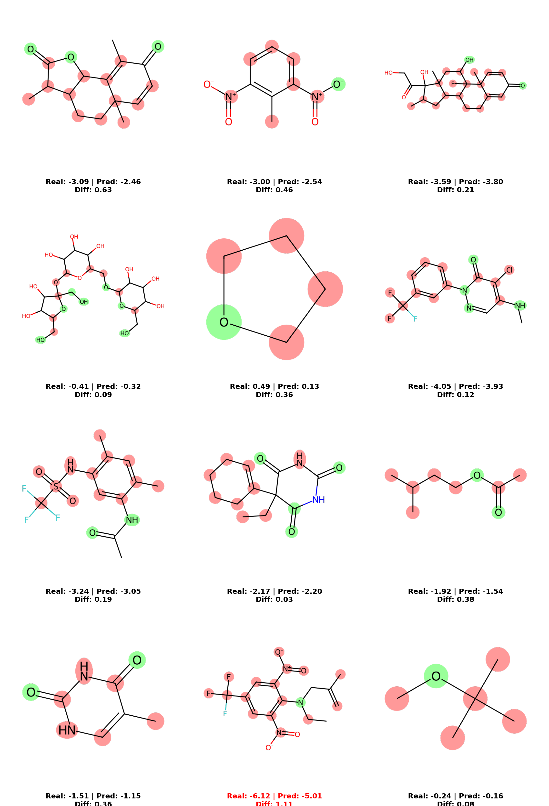
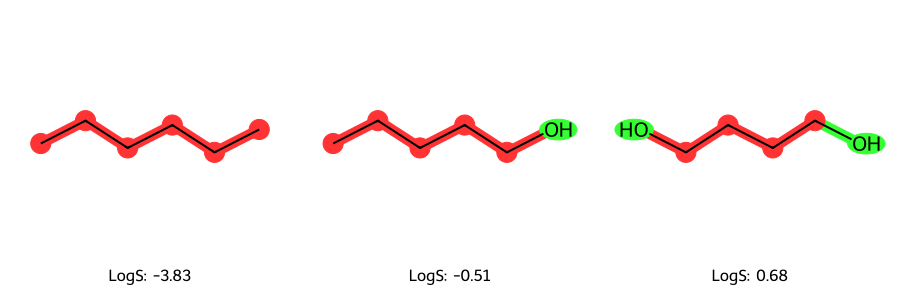
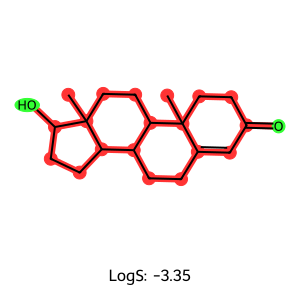

# 🧪 Explainable AI for Drug Discovery: Molecular Solubility Prediction


### 🔍 Overview
This project bridges **Chemical Engineering** and **Deep Learning** by building a model that not only predicts the aqueous solubility (LogS) of drug-like molecules but **explains its reasoning**.

Using a **Bi-Directional LSTM** trained on SMILES strings, the model achieves high accuracy on the Delaney (ESOL) dataset. Crucially, it utilizes **Integrated Gradients (Explainable AI)** to visualize which functional groups contribute to solubility (hydrophilic) vs. insolubility (hydrophobic).

### 🏆 Key Results
| Metric | Score | Notes |
| :--- | :--- | :--- |
| **RMSE** | **0.3617** | Low error margin (Log units) |
| **R²** | **0.9660** | High correlation with experimental data |

### 🧠 The "Chemical Intuition" (Interpretability)
Unlike "Black Box" models, this network learned actual chemical rules without explicit programming.
* **Green Atoms:** Positively contribute to solubility (e.g., Hydroxyls `-OH`, Amines `-NH2`).
* **Red Atoms:** Negatively contribute (e.g., Carbon chains, Halogens `-Cl`).

#### 1. Validation on Test Set
*A random batch of unseen molecules. Note how the model correctly identifies polar regions (Green) vs. non-polar rings (Red).*


#### 2. Stress Test: The Polarity Shift
*Demonstrating the model's sensitivity to functional group changes.*

* **Hexane (Left):** All Red (Insoluble).
* **Pentanol (Middle):** The `-OH` group turns Green.
* **Butanediol (Right):** Two `-OH` groups make the molecule highly soluble.

#### 3. Stress Test: Complex Structures
*Correctly identifying hydrophilic islands (Green) on a large hydrophobic steroid backbone (Red).*


---

### 🛠️ Technical Implementation

**1. Data Engineering**
* **Custom Tokenizer:** Regex-based tokenizer that respects chemical element symbols (e.g., treating `Cl` as Chlorine, not Carbon + `l`).
* **Featurization:** Raw SMILES strings converted to dense integer tensors.

**2. Model Architecture (`MolecularLSTM`)**
* **Embedding Layer:** Maps atomic tokens to continuous vector space.
* **Bi-Directional LSTM:** Captures molecular context from both directions (e.g., how a Carbon atom behaves depends on its neighbors).
* **Regression Head:** Linear layers to predict continuous LogS value.

**3. Interpretability Stack**
* **Captum:** Used Layer Integrated Gradients to calculate the contribution of each input token to the final output.
* **RDKit:** Used for molecular rendering and mapping attention weights to atomic highlights.

---

### 💻 Installation & Usage

1. **Clone the repo**
   ```bash
   git clone [https://github.com/YOUR_USERNAME/molecular-solubility-prediction.git](https://github.com/SrfttnGngr/molecular-solubility-prediction.git)
   cd molecular-solubility-prediction
